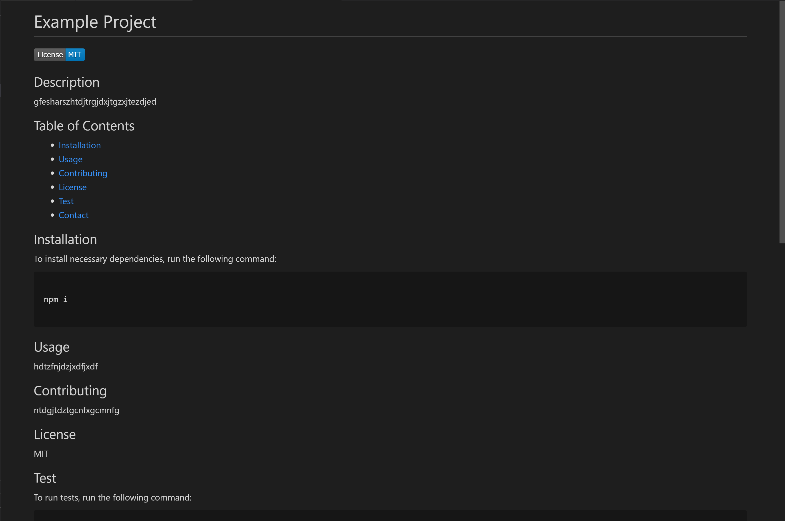

# Professional README Generator

Video link: [https://drive.google.com/file/d/1xJkMt37jJQi1WUS5eJGF4Hp9I-3Del3Y/view?usp=sharing]
Project link: [https://github.com/lillianhuynh/Professional_README_Generator]

## Table of Contents

* [About the Project](#about-the-project)
  * [Built With](#built-with)
* [Getting Started](#getting-started)
  * [Installation](#installation)
* [Usage](#usage)
* [Roadmap](#roadmap)
* [Contributing](#contributing)
* [License](#license)
* [Contact](#contact)

## About The Project


When creating an open source project on GitHub, it’s important to have a high-quality README for the app. This should include what the app is for, how to use the app, how to install it, how to report issues, and how to make contributions—this last part increases the likelihood that other developers will contribute to the success of the project. 

You can quickly and easily generate a README file by using a command-line application to generate one. This allows the project creator to devote more time working on the project.

"Professional_README_Generator" was built to generate a professional README.md file based on user-selected criteria and inputs.

### Built With

node.js

## Getting Started

To get a local copy up and running follow these simple steps.

### Installation

1. Clone the repo
```sh
git clone https://github.com/lillianhuynh/Professional_README_Generator
```

## Usage

By answering prompted questions, users will be able to easily create a professional README file.


## Roadmap

See the [open issues](https://github.com/lillianhuynh/Professional_README_Generator/issues) for a list of proposed features (and known issues).

## Contributing

Contributions are what make the open source community such an amazing place to be learn, inspire, and create. Any contributions you make are **greatly appreciated**.

1. Fork the Project
2. Create your Feature Branch (`git checkout -b feature/AmazingFeature`)
3. Commit your Changes (`git commit -m 'Add some AmazingFeature'`)
4. Push to the Branch (`git push origin feature/AmazingFeature`)
5. Open a Pull Request

## License

N/A

## Contact

Lili Huynh- lillianhuynh312@gmail.com
Project link: [https://github.com/lillianhuynh/Professional_README_Generator]
Video link: [https://drive.google.com/file/d/1xJkMt37jJQi1WUS5eJGF4Hp9I-3Del3Y/view?usp=sharing]


